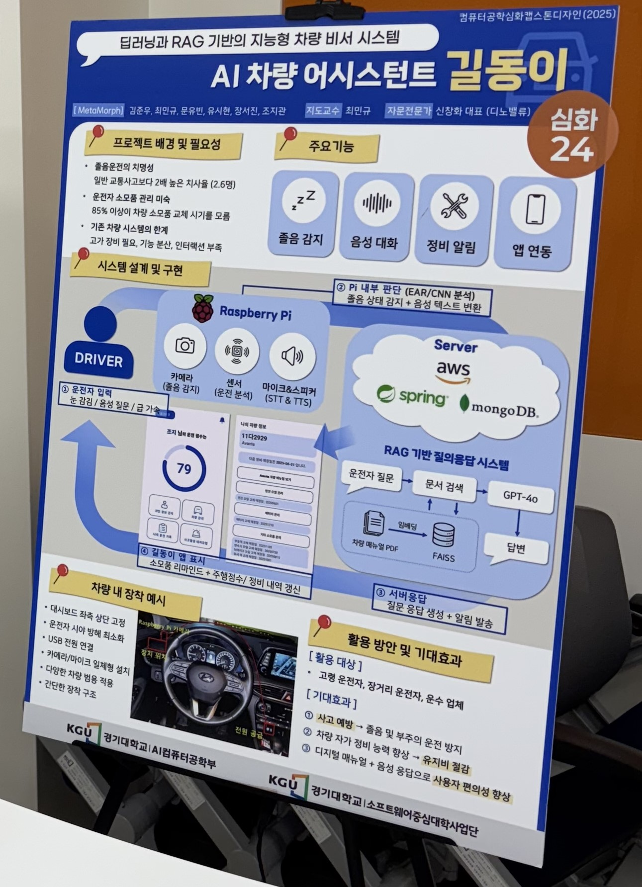

# GildongE – AI 차량 어시스턴트 (심화 캡스톤 디자인 2025)

> 딥러닝 기반 졸음 감지, 음성 대화, 차량 정비 알림 기능을 제공하는 지능형 차량 비서 시스템  
> Spring Boot & MongoDB 기반의 백엔드 API 서버

---

## 🔎 프로젝트 개요

**GildongE**는 운전자의 안전과 편의를 위해 개발된 AI 차량 어시스턴트 시스템입니다.  
졸음 상태 인식, 정비 알림, 음성 대화 및 질문 응답 시스템을 통합해 **차량 내 디지털 비서**로 작동합니다.

---

## ⚙️ 핵심 기능 (백엔드)

- 운전자 졸음 상태 및 센서 데이터 수집 API
- 차량 정비 내역 저장 및 소모품 교체 주기 계산
- 알림 전송 및 차량 상태 기반 실시간 경고 처리
- RAG 기반 질문 응답 시스템 연동 (GPT-4o + FAISS)
- 관리자용 콘텐츠 등록 및 로그 관리 API

---

## 🧱 시스템 구성

```plaintext
[운전자 센서 입력] → [Raspberry Pi (STT/TTS, 졸음 분석)] → [Spring Boot 백엔드 서버] → [MongoDB 저장 및 연동 API]
                                                                                          ↘
                                                                                      [RAG 질문 응답 시스템 (GPT-4o)]
```

- **센서 처리**: 졸음 감지, 음성 인식 및 출력  
- **서버 처리**: 사용자 요청 처리, 데이터 저장, 상태 판단 및 응답  
- **질의 응답 시스템**: 차량 매뉴얼 기반 GPT-4o 응답 제공

---

## 🛠️ 사용 기술 (Tech Stack)

| 분류       | 기술 스택                          |
|------------|------------------------------------|
| 백엔드     | Spring Boot, Java 17               |
| 데이터베이스 | MongoDB (NoSQL)                   |
| 서버 인프라 | AWS EC2, GitHub Actions (CI/CD)    |
| 기타       | RESTful API, JSON, Raspberry Pi 연동, FAISS, GPT-4o API

---

## 👨‍💻 담당 역할

**조지관 (Jigwan Cho)**  
백엔드 개발 담당

- Spring Boot 기반 API 서버 설계 및 구현
- MongoDB 연동 및 모델 설계
- 졸음 상태 및 차량 센서 데이터 저장 API
- REST API 배포 및 문서화

---

## 🖼️ 프로젝트 포스터

> 전체 시스템 아키텍처와 시연 흐름은 아래 포스터에서 확인할 수 있습니다.



---
